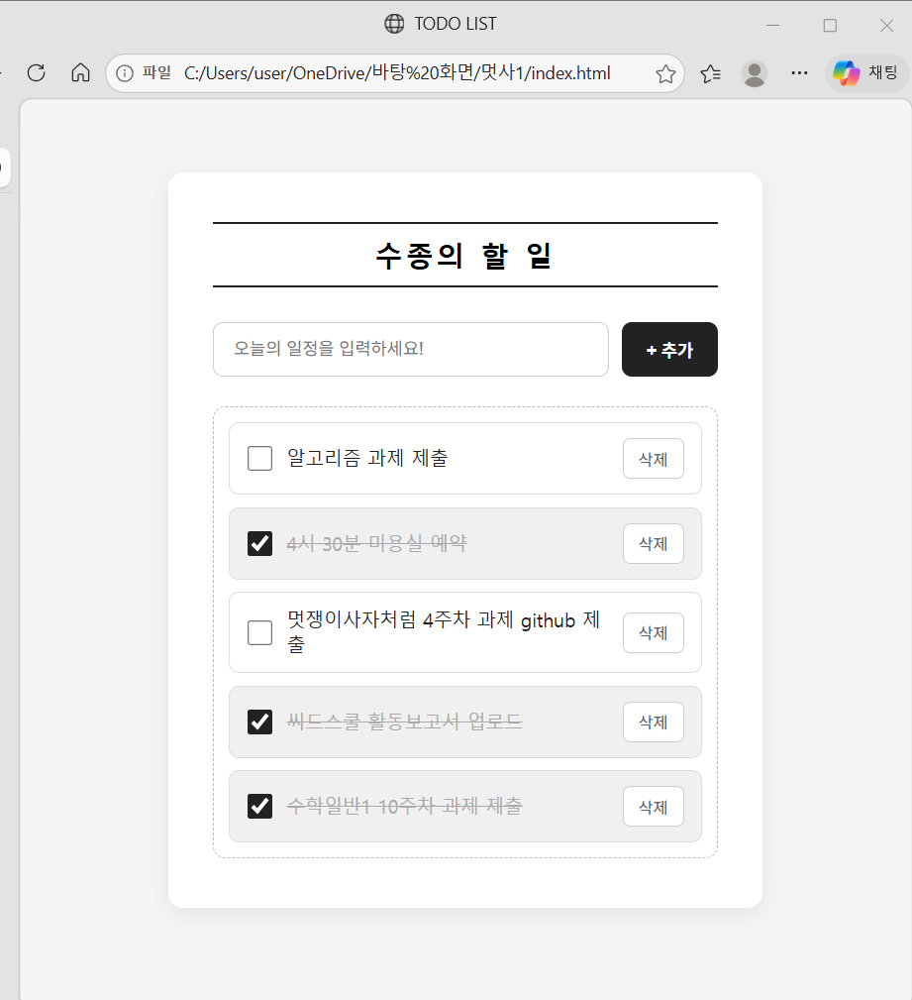

# Todo List

JavaScript를 활용하여 할 일을 추가하고, 완료 여부를 체크하고, 삭제할 수 있는 간단한 투두리스트입니다.

---

## 실행 결과 화면

> 아래 스크린샷은 실제 구현 결과입니다.



| 기능 | 동작 |
|------|------|
| 할 일 추가 | 입력창에 내용 입력 후 `+ 추가` 버튼 클릭 또는 `Enter` |
| 완료 체크 | 체크박스 클릭 → 취소선 + 회색 배경으로 완료 표시 |
| 항목 삭제 | `삭제` 버튼 클릭 → 해당 항목 즉시 제거 |
| 빈 목록 안내 | 항목이 없을 때 안내 문구 자동 표시 |

---

## 구현에 사용한 것들

**파일 구성**

```
todo-list/
├── index.html   # 화면 구조
├── style.css    # 스타일
└── app.js       # 동작 로직
```

**HTML**
- `<input>`, `<button>`, `<ul>`, `<li>` 등 기본 태그로 화면 구조를 구성했습니다.
- `id` 속성을 부여해 JavaScript가 각 요소를 찾을 수 있도록 식별자를 지정했습니다.
- `<script>` 태그를 `<body>` 맨 아래에 배치해 HTML 파싱 완료 후 JS가 실행되도록 했습니다.

**CSS**
- `Flexbox`로 입력창과 버튼을 가로로 정렬하고, 항목 목록은 세로로 쌓이도록 구성했습니다.
- `:hover`, `:focus`, `:active` 가상 클래스로 마우스 인터랙션에 시각적 피드백을 추가했습니다.
- `transition`으로 색상 변화를 부드럽게 처리했습니다.
- `@keyframes`로 항목 추가 시 위에서 내려오는 슬라이드 인 애니메이션을 구현했습니다.
- `.todo-item.done` 복합 선택자로 완료 상태의 스타일(취소선, 배경색)을 별도로 분리했습니다.

**JavaScript**
- `getElementById()`로 HTML 요소를 참조했습니다.
- `addEventListener()`로 클릭과 키보드(`Enter`) 이벤트를 처리했습니다.
- `createElement()` + `insertBefore()`로 새 항목을 동적으로 생성하고 삽입했습니다.
- `todos` 배열로 전체 데이터를 관리하고, `push()` / `filter()` / `find()`로 추가·삭제·탐색을 처리했습니다.
- `classList.toggle()`로 완료 상태에 따라 CSS 클래스를 추가하거나 제거했습니다.
- `Date.now()`를 각 항목의 고유 ID로 활용했습니다.

---

## 구현 과정에서 알게 된 점

**`<script>` 태그의 위치가 중요합니다**  
JavaScript를 `<head>`가 아닌 `<body>` 맨 아래에 배치해야 합니다. HTML이 전부 파싱된 이후에 JS가 실행되어야 `getElementById()`가 요소를 정상적으로 찾을 수 있습니다. 위에 두면 아직 요소가 생성되기 전이므로 `null`이 반환됩니다.

**`id`는 JS용, `class`는 CSS용으로 역할을 구분합니다**  
하나의 요소에 `id`와 `class`를 함께 사용할 수 있습니다. 관례적으로 `id`는 JavaScript에서 특정 요소를 찾을 때, `class`는 CSS에서 스타일을 적용할 때 구분해서 사용합니다.

**`textContent`와 `innerHTML`은 다르게 동작합니다**  
사용자 입력값을 화면에 표시할 때 `.innerHTML`을 사용하면 HTML 태그가 그대로 실행될 수 있습니다. `.textContent`는 모든 값을 문자 그대로 처리하기 때문에 사용자 입력을 다룰 때는 `.textContent`를 사용하는 것이 안전합니다.

**데이터와 화면은 항상 함께 업데이트해야 합니다**  
화면(DOM)만 변경하는 것이 아니라, `todos` 배열도 함께 업데이트했습니다. 항목을 삭제할 때 `li.remove()`로 화면에서 제거하고, `todos.filter()`로 배열에서도 삭제하는 방식입니다. 이렇게 해야 데이터와 화면의 상태가 항상 일치합니다.

**`appendChild`와 `insertBefore`는 삽입 위치가 다릅니다**  
`appendChild`는 부모 요소의 맨 마지막 자식으로 추가합니다. 빈 상태 안내 문구(`emptyMsg`)가 항상 목록 맨 아래에 위치해야 하기 때문에, 새 항목은 그 앞에 끼워 넣는 `insertBefore`를 사용했습니다.

**`filter()`는 원본 배열을 변경하지 않습니다**  
`todos.filter()`는 조건을 만족하는 요소만 담은 새 배열을 반환하며, 원본은 그대로 유지됩니다. 실제로 반영하려면 `todos = todos.filter(...)`처럼 반환된 배열을 재할당해야 합니다.

---

## 실행 방법

```bash
# index.html 파일을 브라우저에서 직접 열거나,
# VS Code에서 Live Server 확장을 설치한 후
# index.html 우클릭 → Open with Live Server 로 실행하시면 됩니다.
```
